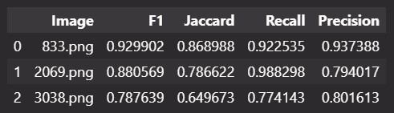
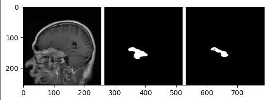
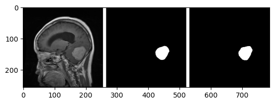
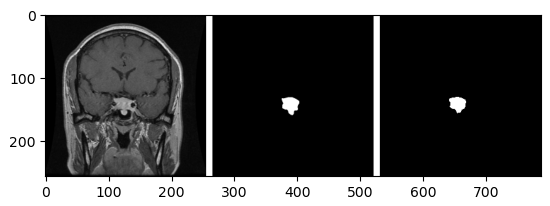

# Brain Tumor Segmentation with U-Net Architecture
This project aims to develop a robust deep learning model for accurately segmenting brain tumors from medical images. The U-Net architecture, renowned for its effectiveness in semantic segmentation tasks, is employed to tackle this challenging problem.

## **Problem:**

Accurate segmentation of brain tumors from medical images is crucial for diagnosis, treatment planning, and monitoring. This project tackles this challenge by leveraging deep learning techniques.

### **Methodology:**

- **Dataset:** Brain tumor images obtained from Kaggle (specify dataset name or link if available)
- **Model Architecture:** U-Net, a popular convolutional neural network (CNN) architecture for semantic segmentation tasks.

**Training:**
- Trained the U-Net model for 50 epochs.
- Utilize appropriate optimization algorithm and loss function (dice coeff).
- Validate the model performance on a separate validation set.

## **Results:**

Validation Accuracy: 93%

Also, the model is tested on three different brain tumor images. This is the precision and recall for all three: 

Also, these are the segmented image on three test images 

## **Project Structure:**

- `data.py` Contain modules for data 
- `brain-tumor-segmentation-using-u-net.ipynb` Jupyter Notebooks for data preprocessing, model training, and evaluation.
- `model.py` Contain all model hyperparameter configuration, training script and evaluation
- `u-net.py` Contain the Script to build architecture for U-Net
- `README.md` This file 

Feel free to fork this repository, experiment with different hyperparameters, and contribute your findings to the project!
